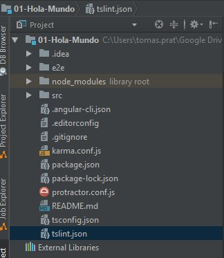
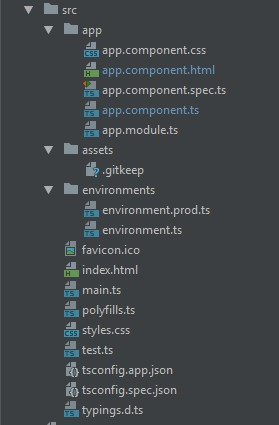
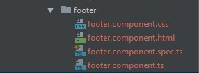

# MyApp

This project was generated with [Angular CLI](https://github.com/angular/angular-cli) version 6.0.8.

## Development server

Run `ng serve` for a dev server. Navigate to `http://localhost:4200/`. The app will automatically reload if you change any of the source files.

## Code scaffolding

Run `ng generate component component-name` to generate a new component. You can also use `ng generate directive|pipe|service|class|guard|interface|enum|module`.

## Build

Run `ng build` to build the project. The build artifacts will be stored in the `dist/` directory. Use the `--prod` flag for a production build.

## Running unit tests

Run `ng test` to execute the unit tests via [Karma](https://karma-runner.github.io).

## Running end-to-end tests

Run `ng e2e` to execute the end-to-end tests via [Protractor](http://www.protractortest.org/).

## Further help

To get more help on the Angular CLI use `ng help` or go check out the [Angular CLI README](https://github.com/angular/angular-cli/blob/master/README.md).

### 33.Creando un entorno local en angular

Instalar angular CLI (command line interfaz)

**ng new nombreProyecto** -> crea un nuevo proyecto


**ng serve** -> levanta proyecto en el puerto 4200 por defecto.

**ng serve -p 4201**-> levantas aplicacion estableciendo el puerto

**ng serve -o** -> levanta el servidor y abre el navegador

en el html si vemos "{{ }}" es una interpolación. Acepta comandos javascript y se puede usar para leer variables del archivo .ts


### 34. Estructura proyeto




**e2e**-> end to end. DEstinado a las pruebas de extemo a extremo.

**node_modules**->son los modulos de node. No se sube a producción.

>npm install reinstala todos los modulos de angular en el proyecto según esté configurado en package.json

**src**-> source

**.editconfig**-> propiedades del editor

**.gitignore**-> archivos a ignorar (ej. los modulos no se suben)

**angular.json**-> le dice a angular como es nuestra aplicación y como funciona. Modificamos normalmente assets, styles y scripts. En el momento de crear el ejecutable se unifican todos los styles y scripts. 

**package-lock.json**->no se toca,se genera cuando vamos modificando el package.josn

**package.json**-> No se manipula manualmente, establece las edpendencias que usaremos para produccion y desarrollo entre otras cosas.

**README.md**-> Archivo informativo.

**tsconfig**-> le dice a typescript como trabjar.

**tslint.json**-> reglas de como escribir en typescritp

#### src



**app** -> archivos de la aplicacion. 

**.css**-> css del componente html

**.spec.ts**-> para hacer test a los componentes 

**.module.ts**-> clase con decorador @NgModule. Se explica más adelante, pero aqui es donde se van poniendo los componentes y demas archivos propios del modulo.

**assets**-> carpeta para recursos estáticos. Dentro tiene un archivo .gitKeep para que se suba la carpet a git sin dejarla vacía.

**enviorments**->Almacena variables del entorno para usarse en produccion o desarrollo.

**browserlist**->archivo de angular d ela version 6, ni idea de para que es

**favicon**

**index.html**->pagina que se renderiza de inicio

**karma.conf.js**->archivo de configuración de pruebas de karma

**main.ts**-> es el primer archivo que se utilizará para lanzar la aplicación.Configura la plataforma.

**polyfills**->ayuda a configuraciones de viejos navegadores web

**styles**->estilos para toda la aplicacion

**tsconfig.app**->configuracion de typescript

**tsconfig.app.spec**->configuracion typescript para hacer los test

**tslint.json**->configuracion de como mostrará los errores typescript.

### 35. Utilizando bootstrap

Añadimos link bootstrap en el head del archivo index.html

Creamos manualmente los componentes. Normalmente dentro de una carpeta componentes. Se le suele poner el nombre app para los componentes propios.

```javascript
import {Component} from '@angular/core';

@Component({
  selector: 'app-header',
  template: `<h1>Header component</h1>`
})
export class HeaderComponent {

}
```

Una vez creado el componente es necesario configurarlo en app.module.ts 

```javascript
import { BrowserModule } from '@angular/platform-browser';
import { NgModule } from '@angular/core';

import { AppComponent } from './app.component';
import { HeaderComponent } from './components/header/header.component';

@NgModule({
  declarations: [
    AppComponent,
    HeaderComponent
  ],
  imports: [
    BrowserModule
  ],
  providers: [],
  bootstrap: [AppComponent]
})
export class AppModule { }
```

### 36. TemplateUrl: Separando el HTML el componente.

Aunque el template del componente se puede poner dentro del propio componente, cuando el template tiene más de 3 lineas conviene sacarlo creando un archivo.  
E. body.component.html

```xml
import {Component} from '@angular/core';

@Component({
  selector: 'app-body',
  templateUrl: './body.component.html'
})
export class BodyComponent {
   body = 'Me llaman body';
}
```

### 37. Creando el footer.component


Angular CLI permite crear automaticamente componentes

>ng generate nombreComponente rutaARchivo 




Para estilos globales mejor usar el css global.


### 39.Estructura body component.

Crea la estructura para explicar luego el ngIf y ngFor

```xml
<div class="row">
  <div class="col">
    <h1>*ngIF</h1>
    <div class="card text-white bg-primary mb-3" style="max-width: 18rem;">
      <div class="card-body">
        <h5 class="card-title">Primary card title</h5>
        <p class="card-text">Some quick example text to build on the card title and make up the bulk of the card's content.</p>
      </div>
    </div>
    <button class="btn-outline-primary">Mostrar ocultar</button>

  </div>
  <div class="col">
  <h1>*ngFor</h1>
    <ul class="list-group">
      <li class="list-group-item">Cras justo odio</li>
      <li class="list-group-item">Dapibus ac facilisis in</li>
      <li class="list-group-item">Morbi leo risus</li>
      <li class="list-group-item">Porta ac consectetur ac</li>
      <li class="list-group-item">Vestibulum at eros</li>
    </ul>
  </div>
</div>
```


### 39. Directivas estructurales

Son instrucciones que agregan, eliminan o reemplazan elementos HTML en el template

*ngIf="condicion" -> si la condicion es false desaparece del html el contenido

*ngFor ="let p of personajes" -> trabaja con arreglos

```xml
<div class="row">
  <div class="col">
    <h1>*ngIF</h1>
    <div *ngIf="mostrar" class="card text-white bg-primary mb-3" style="max-width: 18rem;">
      <div class="card-body">
        <h5 class="card-title">{{frase.autor}}</h5>
        <p class="card-text">{{frase.mensaje}}</p>
      </div>
    </div>
    <button (click)="mostrar =!mostrar" class="btn-outline-primary" onclick="">Mostrar ocultar</button>

  </div>
  <div class="col">
  <h1>*ngFor</h1>
    <ul class="list-group">
      <li *ngFor="let p of personajes; let i = index " class="list-group-item">{{i}} - {{p}}</li>
    </ul>
  </div>
</div>
```
```xml
import {Component} from '@angular/core';

@Component({
  selector: 'app-body',
  templateUrl: './body.component.html'
})
export class BodyComponent {
  mostrar: true;

  frase: any = {
    mensaje: 'Me llaman body',
    autor: 'il capo'
  };
  personajes: string [] = ['papa noel', 'melchor', 'gaspar', 'baltasar'];
}
```
